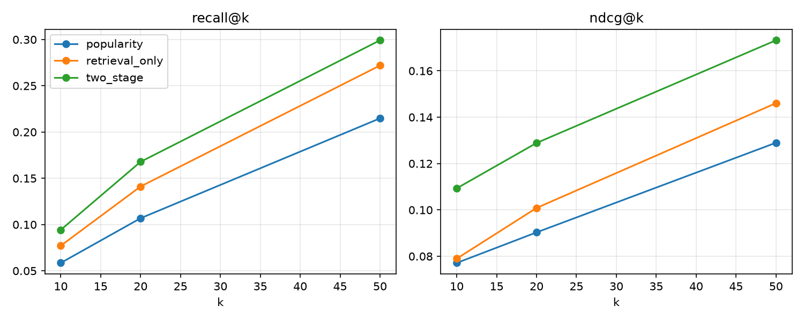

# Moteur de recommandation personnalisée en deux étapes

**Python · TensorFlow · FAISS** — génération de candidats par embeddings, puis modèle de classement, évalués avec **NDCG@k** et **recall@k**. Les résultats sont exportés en modèle en étoile pour **Power BI / Tableau**.

> Statut : terminé. Pipeline complet, tests unitaires et résultats ci-dessous (voir « Résultats »).

---

## 1. Problème et approche

Un catalogue de milliers (ou millions) d'items ne peut pas être scoré en entier par un modèle riche. Le standard industriel est donc une cascade :

```
                 tout le catalogue (N items)
                           │
        ┌──────────────────▼──────────────────┐
        │ ÉTAPE 1 — Génération de candidats   │  rapide, rappel élevé
        │ Two-tower (TensorFlow) + index FAISS│  → top 100 par utilisateur
        └──────────────────┬──────────────────┘
                           │ 100 candidats
        ┌──────────────────▼──────────────────┐
        │ ÉTAPE 2 — Classement                │  précis, plus coûteux
        │ MLP + features croisées (TensorFlow)│  → top 10 / 20 / 50
        └──────────────────┬──────────────────┘
                           │
              Évaluation : recall@k, NDCG@k
                           │
              Export CSV (schéma en étoile) → Power BI
```

| Étape | Rôle | Métrique clé |
|---|---|---|
| 1. Retrieval | ne rien rater : récupérer les bons items parmi des milliers | **recall@100** (plafond du système) |
| 2. Ranking | bien ordonner les candidats | **NDCG@k**, recall@k |

## 2. Données

- **MovieLens 100K** (943 utilisateurs, 1 682 films, 100 000 notes), téléchargé automatiquement depuis GroupLens.
- Un mode `--dataset synthetic` génère un jeu hors-ligne (préférences latentes par genre + popularité).
- **Feedback implicite** : note ≥ 4 = interaction positive.
- Features : utilisateur (sexe, tranche d'âge, profession), item (genres, année, popularité).

## 3. Protocole d'évaluation (sans fuite)

Découpage **chronologique par utilisateur** (≥ 5 positifs) :

```
 passé ─────────────────────────────────────────────► récent
 [ retriever 50% ][ ranker 20% ][ valid 10% ][ test 20% ]
```

- `retriever` entraîne l'étape 1 ;
- `ranker` fournit les **labels** de l'étape 2 : le retriever ne les a jamais vus, donc ses scores sont réalistes (pas de surapprentissage transmis au classeur) ;
- `valid` : early stopping des deux modèles ;
- `test` : évaluation finale, historique = tout ce qui précède. Les items déjà vus sont exclus des recommandations.
- La popularité utilisée comme feature est calculée sur le seul segment `retriever` pour ne pas fuiter les labels.

### Métriques (binaires, par utilisateur puis moyennées)

- **recall@k** = |recommandés@k ∩ pertinents| / |pertinents|
- **NDCG@k** = DCG@k / IDCG@k, avec DCG = Σ rel_j / log₂(j+1) : récompense de placer les bons items **haut** dans la liste
- **hit-rate@k**, **couverture du catalogue**, **popularité moyenne** des recommandations (angle métier / diversité)

Baselines comparées : **popularité**, **retrieval seul**, **pipeline complet (retrieval + ranking)**, plus le **plafond de candidats** (recall@100).

## Résultats

MovieLens 100K, jeu de **test** chronologique, index FAISS HNSW, items déjà vus exclus (`python run_pipeline.py --index hnsw`) :

| Modèle | recall@10 | NDCG@10 | recall@20 | NDCG@20 | NDCG@50 |
|---|---|---|---|---|---|
| Popularité | 0,059 | 0,077 | 0,107 | 0,090 | 0,129 |
| Retrieval seul (two-tower + FAISS) | 0,077 | 0,079 | 0,141 | 0,101 | 0,146 |
| **Pipeline complet (retrieval + ranking)** | **0,094** | **0,109** | **0,168** | **0,129** | **0,173** |

- Le classeur apporte **+38 % de NDCG@10** par rapport au retrieval seul (0,079 → 0,109) et **+42 %** par rapport à la popularité.
- Plafond de l'étape 1 : **recall@100 = 0,42** (hit-rate@100 = 0,91), donc borne supérieure du recall du classeur.
- Diversité (k = 10) : couverture du catalogue de 22 % pour le pipeline complet, contre 3 % pour la popularité (le retrieval seul atteint 40 %, au prix d'un meilleur classement perdu).



Résultats d'une exécution unique (une graine) sur un petit jeu : les écarts relatifs sont fiables, les valeurs absolues restent indicatives.

## 4. Détail des modèles

### Étape 1 — Two-tower + FAISS (`recsys/retrieval.py`)
- **Tour utilisateur** : embedding de l'id + sexe + âge + profession → MLP → vecteur L2-normalisé.
- **Tour item** : embedding de l'id + genres multi-hot → MLP → vecteur L2-normalisé.
- **Perte** : softmax avec **négatifs in-batch**, température τ = 0,1, **correction logQ** (compense le biais de popularité de l'échantillonnage) et masquage des faux négatifs (même item répété dans le batch).
- **Sélection** : early stopping sur le recall@50 de validation.
- **Index FAISS** sur les vecteurs d'items (produit scalaire = cosinus) :
  - `flat` : exact (référence) ;
  - `hnsw` : graphe approché, latence quasi constante ;
  - `ivf` : partitionnement approché.
  `scripts/benchmark_faiss.py` mesure le compromis recall / latence sur de gros catalogues.
- Les items déjà vus sont retirés après recherche (sur-récupération `overfetch`).

### Étape 2 — Classement (`recsys/ranking.py`)
Modèle pointwise (MLP, sortie sigmoïde) sur chaque paire (utilisateur, candidat) :

| Famille | Features |
|---|---|
| Retrieval | score cosinus, écart au meilleur candidat, log du rang |
| Item | log-popularité, année, genres |
| Croisées | affinité du profil de genres de l'historique avec l'item, écart de popularité vs. l'historique |
| Utilisateur | taille de l'historique, embedding id ⊙ embedding item |

Perte : entropie croisée pondérée (positifs rares), early stopping sur l'AUC de validation.

## 5. Volet BI

`export_bi` écrit dans `outputs/bi/` un **modèle en étoile** :

| Table | Type | Contenu |
|---|---|---|
| `dim_user.csv` | dimension | sexe, âge, tranche d'âge, profession |
| `dim_item.csv` | dimension | titre, année, genre principal, popularité |
| `fact_interactions.csv` | fait | interactions étiquetées par split |
| `fact_recommendations.csv` | fait | top-20 par utilisateur : rang, scores, hit |
| `fact_metrics.csv` | fait | recall / NDCG / hit par modèle et par k |
| `fact_user_metrics.csv` | fait | métriques par utilisateur + attributs → analyse par segment |
| `fact_diversity.csv` | fait | couverture du catalogue, popularité moyenne |
| `fact_genre_exposure.csv` | fait | part de chaque genre : catalogue vs. consommé vs. recommandé |

Pages de dashboard et mesures DAX : voir [docs/POWERBI.md](docs/POWERBI.md).

Questions métier auxquelles le dashboard répond : le moteur sert-il mieux certains segments (âge, profession) ? Sur-expose-t-il les genres populaires ? Quel est le gain réel du classeur sur le retrieval seul ?

## 6. Exécution

```bash
python -m venv .venv
.venv\Scripts\activate            # Windows  (source .venv/bin/activate sous Linux/macOS)
pip install -r requirements.txt

pytest -q                          # tests unitaires (métriques, découpage)
python run_pipeline.py             # MovieLens 100K, index exact
python run_pipeline.py --index hnsw --save-artifacts
python run_pipeline.py --dataset synthetic            # hors-ligne
python scripts/benchmark_faiss.py --n-items 200000
```

Sorties : `outputs/metrics.json`, `outputs/metrics.png`, `outputs/bi/*.csv`.

> **Windows** : si l'import de `faiss` échoue (stratégie de contrôle d'application / Smart App Control bloquant une DLL non signée), le code bascule automatiquement sur un index NumPy exact (même interface, résultats identiques en `flat`). Pour tester HNSW/IVF, exécutez le projet sous WSL, Linux ou Google Colab.

## 7. Structure

```
recsys/
  config.py      hyperparamètres
  data.py        chargement, jeu synthétique, découpage chronologique
  metrics.py     recall@k, NDCG@k, hit-rate, couverture
  retrieval.py   two-tower TensorFlow, index FAISS, génération de candidats
  ranking.py     features, modèle de classement, reclassement
  pipeline.py    TwoStageRecommender + évaluation de bout en bout
  bi_export.py   export en étoile pour Power BI + graphique
run_pipeline.py  point d'entrée CLI
scripts/benchmark_faiss.py
tests/
docs/POWERBI.md
```

## 8. Limites et pistes

- Classeur **pointwise** : passer à une perte **listwise / LambdaRank** (`tensorflow_ranking`) optimiserait directement le NDCG.
- Le retriever n'utilise pas la séquence récente de l'utilisateur : ajouter un encodeur de session (GRU / attention) à la tour utilisateur.
- MovieLens 100K est petit : l'intérêt de FAISS ANN n'apparaît qu'à grande échelle (benchmark fourni).
- Évaluation hors-ligne seulement : en production, valider par **A/B test** (CTR, conversion).
- Pistes : négatifs difficiles, calibration, diversification (MMR), suivi de dérive.
